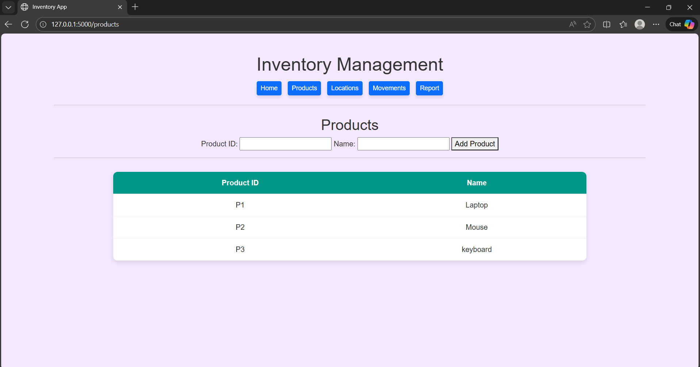
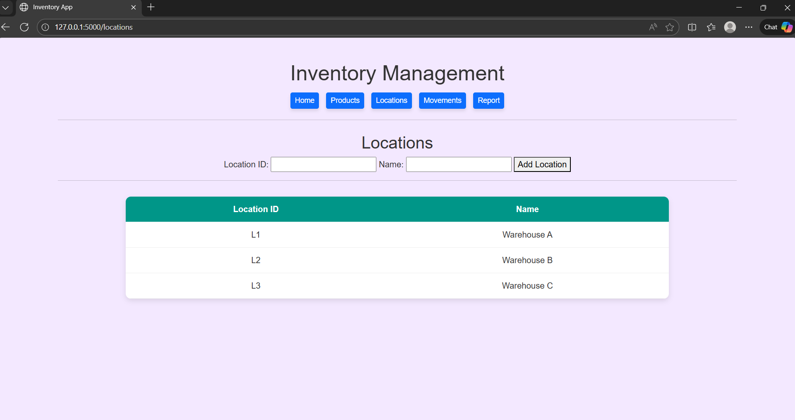
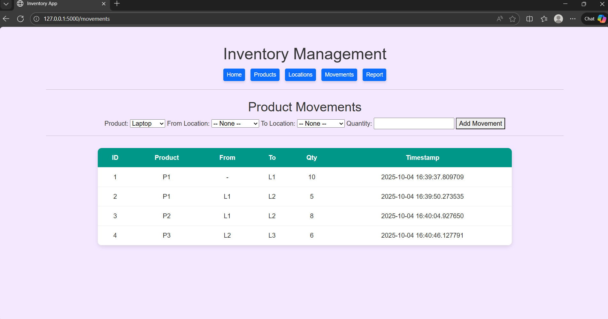
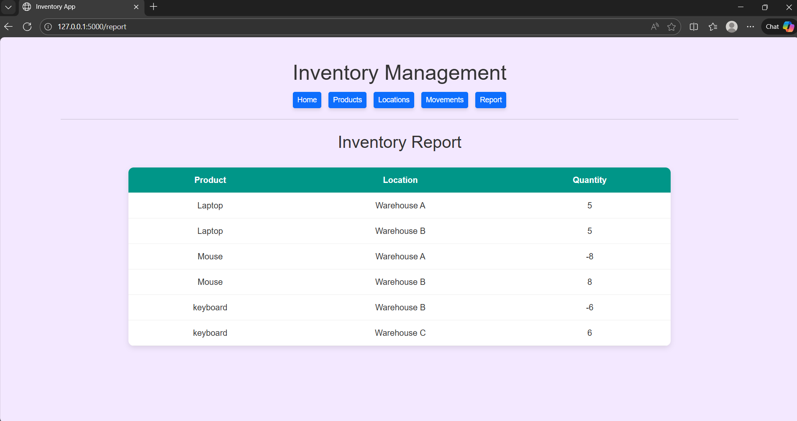

# 📦 Inventory Management Web App (Flask)

A simple **Inventory Management System** built using **Flask** + **SQLite** + **SQLAlchemy**.
It allows managing **Products, Locations, and Product Movements**, and generates a **stock balance report**.

---

## 🚀 Features

* Add and view **Products**
* Add and view **Warehouse Locations**
* Record **Product Movements**:

  * Stock **In** (into a location)
  * Stock **Out** (from a location)
  * **Transfer** between locations
* Generate **Inventory Balance Report** (Product | Location | Quantity)

---

## 🛠️ Tech Stack

* **Python 3**
* **Flask** – Web framework
* **SQLAlchemy** – ORM
* **SQLite** – Database
* **Waitress** – Production server

---

## ⚙️ Setup & Run

### 1. Clone the Repository

```bash
git clone https://github.com/YOURNAME/inventory_app.git
cd inventory_app
```

### 2. Create Virtual Environment (Optional but Recommended)

```bash
python -m venv venv
.env\Scripts\Activate   # On Windows
```

### 3. Install Dependencies

```bash
pip install -r requirements.txt
```

### 4. (Optional) Seed Test Data

```bash
python seed.py
```

### 5. Run the Application

```bash
python app.py
```

### 6. Open in Browser

👉 [http://127.0.0.1:5000](http://127.0.0.1:5000)

---

## 📊 Example Use Case

**Add Products:**

* P1 → Laptop
* P2 → Mouse
* P3 → Keyboard

**Add Locations:**

* L1 → Warehouse A
* L2 → Warehouse B

**Record Movements:**

* 10 Laptops into Warehouse A
* 5 Mice into Warehouse A
* 2 Laptops transferred Warehouse A → Warehouse B

**Check Report:**

| Product | Location    | Quantity |
| ------- | ----------- | -------- |
| Laptop  | Warehouse A | 8        |
| Laptop  | Warehouse B | 2        |
| Mouse   | Warehouse A | 5        |
### 🖥️ Products


### 🏢 Locations


### 🔄 Movements


### 📊 Report


